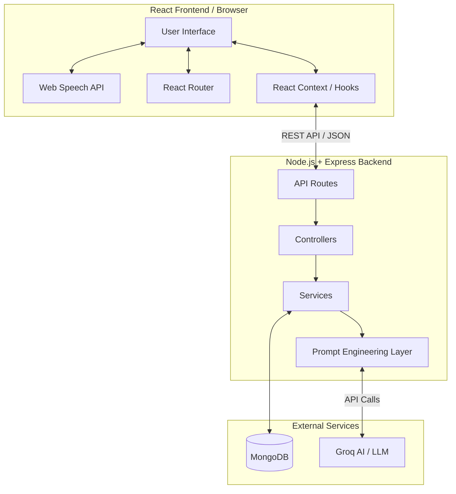
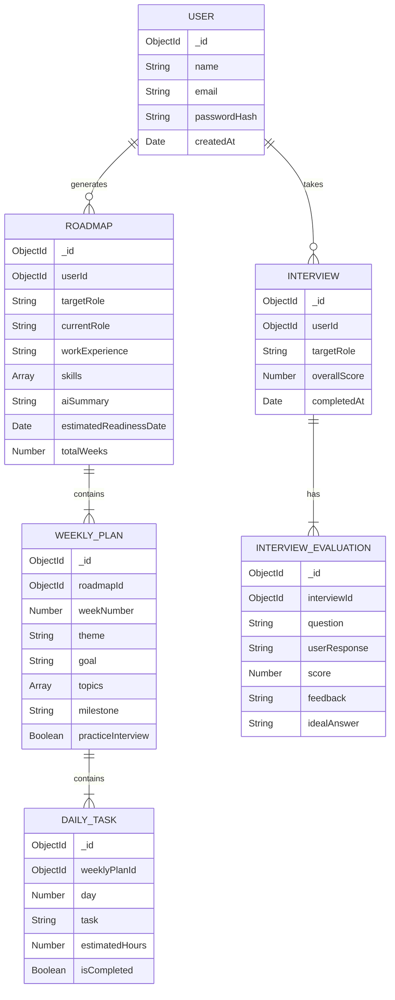

# Career R&I (Career Roadmap & AI Mock Interview)
**Comprehensive Project Documentation**

---

## 1. Project Overview
**Career R&I** is a sophisticated, AI-driven web application designed to help individuals shape their career paths and ace job interviews. The platform acts as a personal career command center, offering dynamically generated, week-by-week learning roadmaps tailored to the user's specific goals and background. Alongside the roadmap, the application features an immersive, voice-enabled AI Mock Interview environment that evaluates candidates in real-time.

## 2. Core Features
- **AI-Powered Career Roadmaps:** Users enter their educational background, skills, and target job role. The AI generates a customized, multi-week execution plan containing weekly goals, daily tasks, and milestones.
- **Voice-Enabled Mock Interviews:** A seamless interface leveraging the microphone and browser speech recognition to simulate real interviews.
- **Real-Time Evaluation:** Integration with the Groq API (LLMs) to evaluate user responses instantly, providing scoring and constructive feedback.
- **Interactive Dashboard:** A "Command Center" dashboard displaying overall progress, active roadmaps, and interview performance history.
- **Premium UI/UX:** A highly polished, light-themed aesthetic featuring glassmorphism, dynamic micro-animations (Framer Motion), semantic color tokens, and a clean, responsive layout.

---

## 3. Technology Stack

### Frontend (Client)
- **Framework:** React.js + Vite
- **Routing:** React Router DOM
- **Styling:** Custom CSS with semantic design tokens, Tailwind utility aliases.
- **Animations:** Framer Motion (page transitions, interactive components, complex loading screens)
- **Icons:** Lucide React
- **Web APIs:** Web Speech API (SpeechRecognition for voice input)

### Backend (Server)
- **Environment:** Node.js + Express.js (written in TypeScript)
- **Database:** MongoDB + Mongoose ORM
- **AI Integration:** Groq API SDK (using optimized open-source LLMs like Llama-3 for ultra-low latency response evaluation and roadmap generation)
- **Authentication:** JWT (JSON Web Tokens)
- **Middleware:** Custom error handling, validation layers, CORS.

---

## 4. System Architecture

---

## 5. Database Schema & Models

---

## 6. Design System & UI/UX Guidelines

The platform strictly adheres to a premium **Semantic Light Theme**, avoiding hardcoded hex values in favor of defined CSS variables.

### Color Tokens
- **Primary:** `--primary` (`#8067e8`) - Deep purple for main CTAs, active states, progress bars.
- **Primary Soft:** `--primary-soft` (`#e3dcff`) - Tinted backgrounds for active cards, badges, and avatars.
- **Primary Text:** `--primary-text` (`#5d45c7`) - High contrast text over soft backgrounds.
- **Surface:** `--surface-solid` (`#ffffff`) - Pure white for interactive cards.
- **Surface Muted:** `--surface-muted` (`#f4f6fa`) - Light gray for application backgrounds and input fields.
- **Feedback Colors:**
  - **Success:** `--success` (`#45a66b`) & `--success-soft`
  - **Warning:** `--warning` (`#f5a623`) & `--warning-soft`
  - **Danger:** `--danger` (`#d95757`) & `--danger-soft`
  - **Coral:** `--coral` (`#e9773f`) - Used for highlights and milestones.

### Visual Patterns
- **Buttons (`.btn`):** Use solid flexbox alignment, consistent padding (`.btn-md`), rounded corners (`var(--radius-btn)`), and hover lift (`translateY(-1px)`).
- **Cards (`.card`):** Bordered (`1px solid var(--border)`), padded (`24px`), with subtle shadows (`var(--shadow-sm)`).
- **Glassmorphism:** Applied sparingly on sticky headers and floating elements using `backdrop-filter: blur(16px)` combined with semi-transparent background colors.

---

## 7. Key Modules & Workflows

### A. AI Roadmap Generation Workflow
1. **Onboarding (/roadmap/start):** A multi-step animated form collecting the user's name, experience, education, skills, and desired role.
2. **AI Processing:** The frontend displays a cinematic loading screen with rotating animated rings and dynamic progress messages. The backend constructs a prompt instructing the LLM to output a JSON-formatted 8-week execution plan.
3. **Dashboard View (/roadmap/:id):**
   - **Hero Section:** Features a sticky header with dynamic scroll tracking and a circular SVG progress ring.
   - **Journey Map:** Expandable Week Accordion cards. Clicking a week reveals daily tasks (with checkmarks), topics, and a weekly milestone. 

### B. AI Mock Interview Workflow
1. **Setup (/setup):** User confirms the target role and interview focus.
2. **Interview Interface (/interview):**
   - Features an AI "Interviewer" Avatar bubble.
   - A pulsing, animated microphone button utilizing the Web Speech API to capture user spoken answers.
   - Live transcript display with a blinking cursor effect simulating active listening.
3. **Evaluation Generation:** User submits their response. The backend sends the question and transcript to Groq. The prompt explicitly asks the AI to act as a strict technical recruiter, scoring the answer and providing constructive critique.
4. **Report Page (/report):** Displays the final aggregate score, badges highlighting strengths/weaknesses, and detailed breakdown cards for every question asked.

---

## 8. Development & Maintenance Guidelines

- **Strict Separation of Concerns:** Do not mix inline style overrides (like `linear-gradient`) when utility classes or CSS tokens exist.
- **Responsive Layouts:** The app uses a max-width wrapper (`max-w-4xl` or `max-w-760`) for readability, adapting flexbox directions on mobile.
- **Asynchronous AI Calls:** AI generation relies on external LLM inference. All AI requests must have comprehensive loading states on the client and robust `try/catch` error handling on the server, mapping raw LLM text to strict JSON schema validation.
